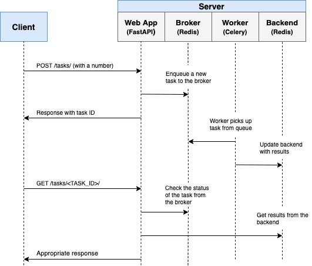
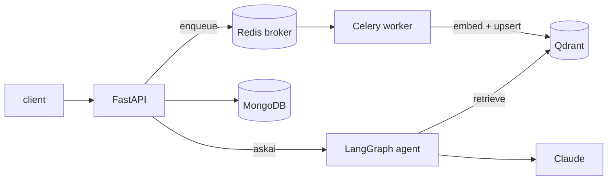

# 🧠 GenAI Labs Research Assistant

> A FastAPI and Celery backend that ingests research-document chunks into Qdrant and answers questions over them with an intent-routing LangGraph agent.

**GenAI Labs is an asynchronous document-retrieval backend: uploads are embedded by Celery workers into a hybrid (dense plus BM25) Qdrant collection, similarity search runs as a job, and `/api/askai/` classifies the question as Q&A, summarise or compare and answers with Claude from the retrieved chunks.**

<!-- readme-header -->
      

## What it does

- **Ingestion.** `PUT /api/upload/` accepts a JSON file or a URL of pre-chunked documents. FastAPI queues the work on Redis, a Celery worker embeds each chunk (`all-MiniLM-L6-v2` dense plus `Qdrant/bm25` sparse) and upserts it into the `genailabs_research_assistant` Qdrant collection. Journal and chunk records are kept in MongoDB. The client polls a job id for status.
- **Similarity search.** `POST /api/similarity/` takes a query, `top_k` and `min_score`, and returns results through a job id.
- **Ask AI.** `POST /api/askai/` runs a LangGraph agent that extracts the intent and any document ids from the question, then routes to Q&A over retrieved chunks, summarisation of one document by `source_doc_id`, or comparison of two documents. The model is Claude through `langchain_anthropic`.

## Architecture





A write-up of the ingestion pipeline is in [docs/Ingestion_Pipeline.pdf](docs/Ingestion_Pipeline.pdf).

## Quickstart

Requires Docker.

1. Create a `.env` at the repo root (it is git-ignored). Use your own values:

   ```
   MONGO_URI=<mongodb connection string>
   MONGO_DB_NAME=genailabs_db
   ANTHROPIC_API_KEY=<your Anthropic API key>
   ```

   `MONGO_URI` defaults to the `mongodb` service in `docker-compose.yml` if unset; see `app/core/config.py`. Without an API key the app starts but Ask AI will not work.

2. Build and start (the first build takes several minutes):

   ```bash
   docker build -t genailabs .
   docker-compose up -d
   ```

3. Open the Swagger docs at http://localhost:8001/docs.

The compose file starts the API, one Celery worker, Redis, Qdrant and MongoDB. There is no test suite in this repo.

## API

| Method | Endpoint | Description |
|---|---|---|
| PUT | `/api/upload/` | Upload a JSON file or `file_url` (form fields `file` or `file_url`, plus required `schema_version`) |
| GET | `/api/{job_id}` | Embedding job status and result |
| GET | `/api/journal/{journal_id}` | Chunks for a journal |
| POST | `/api/similarity/` | Start a similarity search |
| GET | `/api/similarity/{job_id}` | Similarity search results |
| POST | `/api/askai/?question=...` | Ask a question; routed by intent |

Each uploaded chunk needs a UUID `id`, `source_doc_id`, `chunk_index`, `section_heading`, `journal`, `publish_year` (YYYY), `usage_count`, `attributes`, `link` and `text`. A sample file is in `app/utils/dataset.json`.

## Configuration

Environment variable names: `MONGO_URI`, `MONGO_DB_NAME`, `ANTHROPIC_API_KEY`, `CELERY_BROKER_URL`, `CELERY_RESULT_BACKEND`, `QDRANT_HOST` (the last three are set by `docker-compose.yml`).

## Project layout

```
app/api         FastAPI routers (embeddings, similarity, askai)
app/handlers    request handlers for upsert and search jobs
app/tasks       Celery app and embedding/search tasks
app/assistant   LangGraph agent, chains, prompts, retrievers, Qdrant access
app/services    MongoDB-backed journal and chunk services
app/core        settings, Mongo client, logging, LLM setup
docs            architecture diagram and ingestion pipeline PDF
```

## Status

Working prototype. The compose file has development defaults (published ports, unauthenticated Qdrant and Redis, a throwaway MongoDB root user) and is not hardened for deployment. The Ask AI endpoint is configured for a Claude 3 Sonnet model id in `app/core/langgrapgh.py`, which may need updating to a current model. No tests, CI or license file are present.
